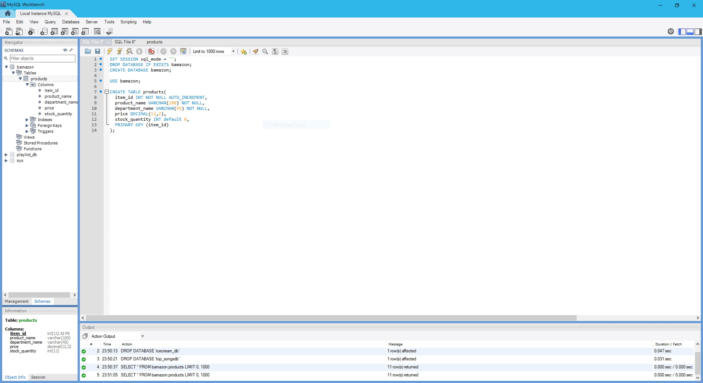
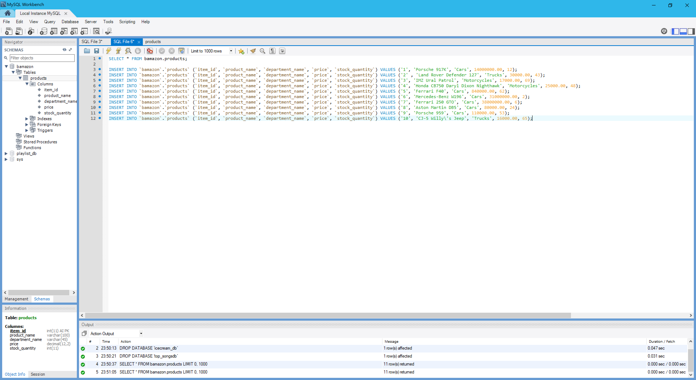
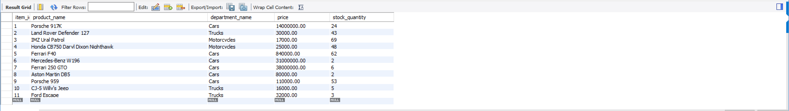

# Amazon-like storefront CLI app using MySQL

 

## MySQL Workbench
***

## Video Walk-through
***

Functionality 1

Functionality 2

## Items to Buy
***

| 1 | Porsche 917K   | $14,000,000.00 	| 2 | Land Rover Defender 127   | $30,000.00 	|
|---|---	         |---	            |---|---	         |---	            |
||||||

 

| 3 | IMZ Ural Patrol   | $17,000.00 	| 4 | Honda CB750 Daryl Dixon Nighthawk   | $25,000.00 	|
|---|---	         |---	            |---|---	         |---	            |
||||||

 

| 5 | Ferrari F40   | $840,000.00	| 6 | Mercedes-Benz W196   | $31,000,000.00 	|
|---|---	         |---	            |---|---	         |---	            |
||||||

 

| 7 | Ferrari 250 GTO   | $38,000,000.00 	| 8 | Aston Martin DB5K   | $80,000.00 	|
|---|---	         |---	            |---|---	         |---	            |
||||||

 

| 9 | Porsche 959   | $110,000.00 	| 10 | CJ-5 Willy's  | $16,000.00 	|
|---|---	         |---	            |---|---	         |---	            |
||||||

 

## Technologies Used
***

* Javascript
* nodeJS
* MySQL
* npm packages:
	- [mysql](https://www.npmjs.com/package/mysql)
	- [inquirer](https://www.npmjs.com/package/inquirer)
	- [cli-table](https://www.npmjs.com/package/cli-table)

